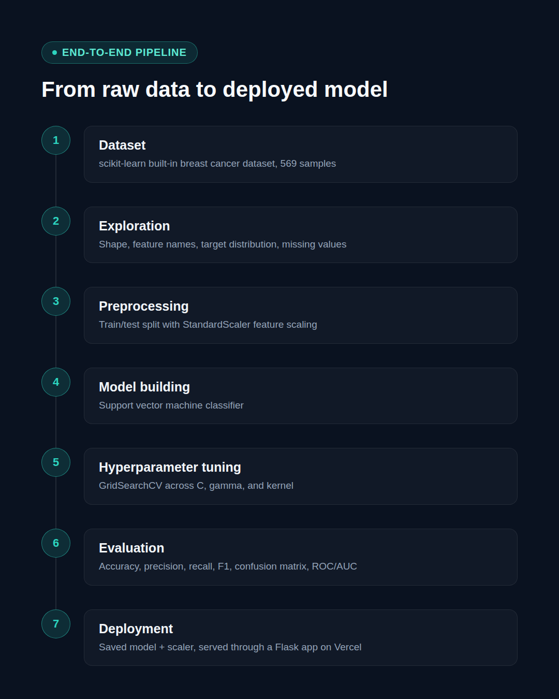
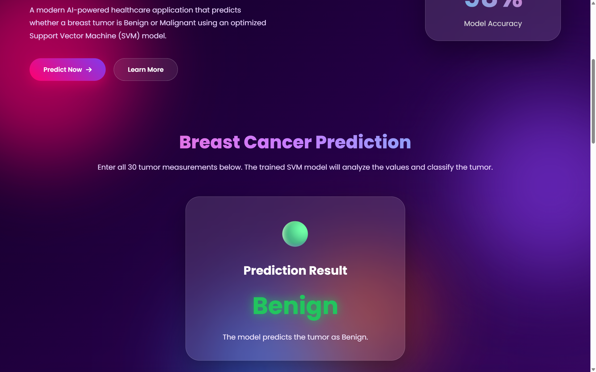
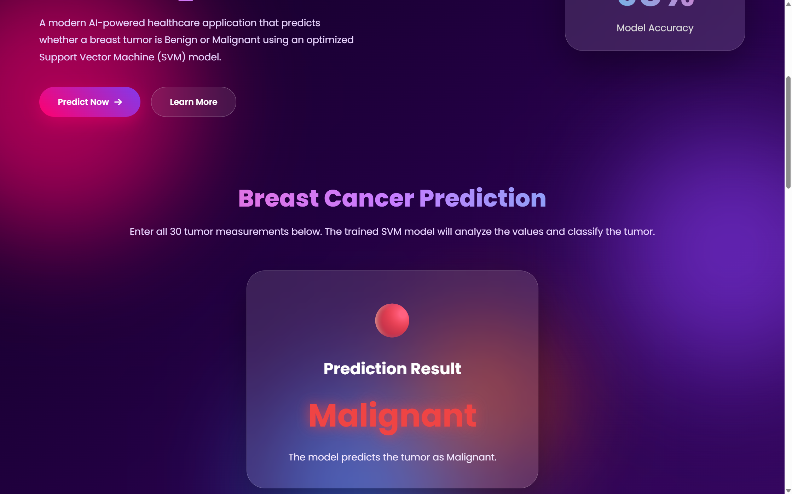

# Breast Cancer Classification using Support Vector Machine

An end-to-end Machine Learning project that classifies breast tumors as **Malignant** or **Benign** using a Support Vector Machine (SVM). The project demonstrates a complete ML workflow—from data preprocessing and model training to evaluation, deployment, and interactive prediction.


## Project Overview

Early detection of breast cancer plays a significant role in improving treatment outcomes.

This project leverages the **Breast Cancer Wisconsin Diagnostic Dataset** to build a binary classification model capable of predicting whether a tumor is **Malignant** or **Benign** based on diagnostic measurements.

Rather than focusing only on model accuracy, this project emphasizes building a reproducible and deployment-ready machine learning pipeline.


## Features

- Binary classification using Support Vector Machine (SVM)
- End-to-end preprocessing pipeline
- Feature scaling with StandardScaler
- Model evaluation using multiple performance metrics
- Interactive web interface for predictions
- Deployment-ready architecture
- Clean and reproducible workflow


## Live Demo

🔗 **Application:** https://svmbreastcancerclassification.vercel.app/


## Project Architecture


Input Features
      │
      ▼
Data Preprocessing
      │
      ▼
Train-Test Split
      │
      ▼
Feature Scaling
      │
      ▼
Support Vector Machine
      │
      ▼
Prediction
      │
      ▼
Performance Evaluation
      │
      ▼
Web Deployment


## Dataset

**Dataset:** Breast Cancer Wisconsin Diagnostic Dataset

**Source:** Scikit-learn (`load_breast_cancer()`)

### Target Classes

|    Class  |  Meaning |
|-----------|----------|
| Malignant | Cancerous Tumor |
| Benign    | Non-Cancerous Tumor |


## Tech Stack

|        Category  | Technology                   |
|------------------|------------------------------|
| Language         | Python                       |
| Machine Learning | Scikit-learn                 |
| Data Processing  | NumPy, Pandas                |
| Visualization    | Matplotlib                   |
| Model            | Support Vector Machine (SVC) |
| Deployment       | Flask                        | 
| Frontend         | HTML, CSS                    |
| Hosting          | Vercel                       |


## Machine Learning Workflow

### 1. Data Loading

- Load Breast Cancer dataset
- Inspect features and target distribution

### 2. Data Preprocessing

- Train-Test Split
- Feature Scaling using StandardScaler

### 3. Model Training

- Support Vector Machine (SVC)

### 4. Model Evaluation

- Accuracy
- Precision
- Recall
- F1 Score
- Confusion Matrix

### 5. Deployment

- Flask backend
- Interactive prediction interface
- Hosted on Vercel


## Model Performance

|   Metric  |     Score     |
|-----------|---------------|
| Accuracy  |    0.98       |
| Precision |    0.98       |
| Recall    |    0.98       |
| F1 Score  |    0.98       |


## Project Structure


Breast_Cancer_Classification/
│
├── static/
│   ├── style.css
│
├── templates/
│   ├── index.html
│
├── model/
│   ├── svm_model.pkl
│   ├── scaler.pkl
│
├── app.py
├── train_model.py
├── requirements.txt
├── README.md
└── LICENSE


## Installation

Clone the repository

```bash
git clone https://github.com/yourusername/Breast-Cancer-Classification.git
```

Move into the project directory

```bash
cd Breast-Cancer-Classification
```

Install dependencies

```bash
pip install -r requirements.txt
```

Run the application

```bash
python app.py
```


## Key Engineering Decisions

- Selected **Support Vector Machine** due to its strong performance on high-dimensional datasets.
- Applied **StandardScaler** before model training to ensure consistent feature magnitudes.
- Maintained identical preprocessing during training and inference to eliminate training-serving mismatch.
- Evaluated performance using multiple classification metrics rather than relying solely on accuracy.

---

## Future Improvements

- Hyperparameter optimization using GridSearchCV
- Cross-validation pipeline
- Probability calibration
- Model explainability using SHAP
- Docker containerization
- CI/CD pipeline
- Automated model monitoring
- Drift detection

---

## Screenshots

### Application Interface

> ****

### Machine Learning Pipeline

> **

### Model Performance

> **

### Prediction Results

> **
> **


## Learning Outcomes

Through this project, I gained practical experience in:

- Support Vector Machines
- Feature Scaling
- Classification Metrics
- Machine Learning Pipelines
- Model Serialization
- Flask Deployment
- End-to-End ML System Development


## License

This project is licensed under the MIT License.


## Author

**Gowtham Vudumu**

Machine Learning Engineer (Aspiring)

LinkedIn: https://www.linkedin.com/in/gowtham-vudumu/

GitHub: https://github.com/GowthamV-CoderX/svm_breast_cancer_classification.git